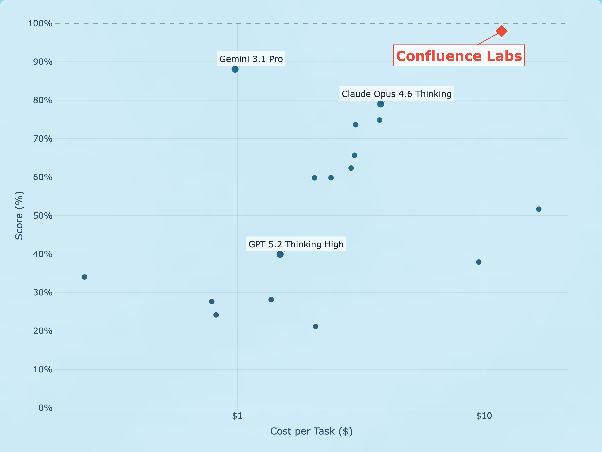

<div align="center">

# Saturating ARC-AGI-2

### [Confluence Labs](https://confluencelabs.com)

[](LICENSE)
[](https://www.python.org/downloads/)
[](https://arcprize.org/)

**97.92% on the ARC-AGI-2 public evaluation set.**



</div>

---

## Overview

Code to reproduce Confluence Labs' state-of-the-art result on the [ARC-AGI-2](https://arcprize.org/) benchmark.

## Quick Start

```bash
# Install dependencies
cd gemini-cli-solver && uv sync && cd ..

# Configure
cp .env.example .env
# Fill in E2B_API_KEY and GEMINI_API_KEY

# Full run
./run.sh

# Smoke test a single task
./run.sh --smoke <task_id>
```

## Configuration

The defaults in `run.sh` are the exact configuration that produced the 97.92% result. Adjust as needed:

| Parameter | Default | Description |
|-----------|---------|-------------|
| `GEMINI_CLI_AGENTS` | 12 | Agents per test input |
| `GEMINI_CLI_MAX_ITERATIONS` | 10 | Max refinement loops per agent |
| `GEMINI_CLI_CONCURRENCY` | 132 | Max simultaneous sandboxes |
| `WALL_CLOCK_LIMIT` | 43200 (12h) | Total wall clock timeout |

## License

MIT — see [LICENSE](LICENSE).
